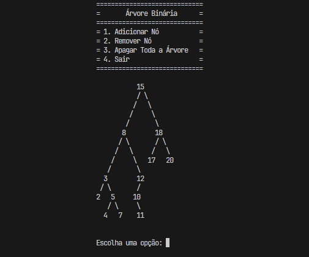

# Sistema de Árvore Binária
[Descrição](#descrição) | [Funcionalidades](#funcionalidades) | [Limitações](#limitações) | [Exemplo visual](#exemplo-visual) | [Instruções para Uso](#instruções-para-uso)

## Descrição
Este projeto implementa um sistema de árvore binária que aceita e manipula números inteiros. Ele oferece funcionalidades de adicionar, remover, buscar e apagar todos os nós da árvore, além de permitir a exibição da estrutura da árvore de forma gráfica e organizada.

## Funcionalidades
- **Inserção de Números:**
  - O sistema permite a inserção de números inteiros na árvore binária. Os números são organizados de acordo com as regras da árvore binária, onde os números menores ou iguais que o nó raiz vão para a subárvore à esquerda e os maiores vão para a subárvore à direita.
  - A inserção dos valores continua até o usuário inserir o caractere "!" para indicar o fim da entrada.

- **Remoção de Números:**
  - O usuário pode remover números específicos da árvore. O sistema cuida da reorganização da árvore para manter as propriedades da árvore binária após a remoção.

- **Busca de Valores:**
  - O sistema permite que o usuário busque valores específicos na árvore, retornando se o valor está presente ou não.
  - Se o valor for achado, será dito quantos passos foram precisos para isso.
  - Para procurar o valor não é necessario o "!" no fim.

- **Apagar a Árvore:**
  - Caso o usuário deseje, a árvore inteira pode ser apagada, removendo todos os nós e liberando a memória associada.

## Limitações
- A árvore binária atualmente aceita apenas números inteiros. Futuras atualizações podem incluir suporte a outros tipos de dados.
- Operações de inserção e remoção estão limitadas à manutenção da estrutura da árvore binária simples.
- Não há suporte para inserção ou manipulação de valores não numéricos.

## Exemplo visual


## Instruções para Uso
1. **Compilação**: Compile o código-fonte usando um compilador C padrão.
2. **Execução**: Execute o programa e siga as instruções no console para inserir e alterar valores na árvore. Para inserir valores na árvore, digite os números inteiros separados por espaços e finalize com "!". Exemplo: "2 7 8 15 92 !"

### Como Compilar
Para compilar o programa, use o seguinte comando no terminal:
```bash
gcc main.c bibliotecas/*.c -I"bibliotecas" -o Main
```
Esse comando compila os arquivos main.c, arvore.c e printar.c e gera o executável main.

### Como Executar
Após compilar, execute o programa com o seguinte comando:

```bash
./Main
```
Isso iniciará o menu interativo, onde você poderá adicionar, remover ou apagar a árvore binária.
